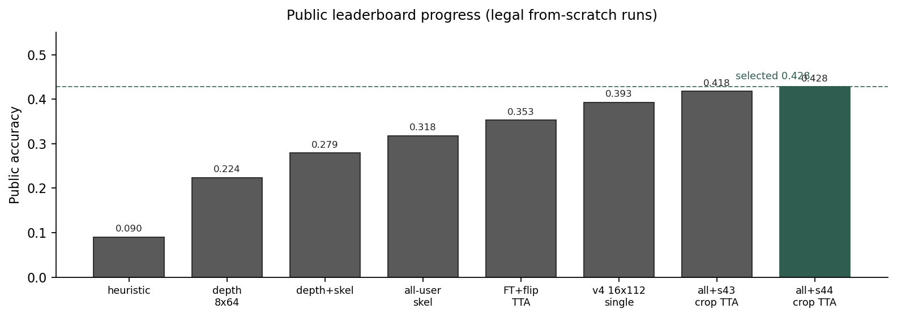
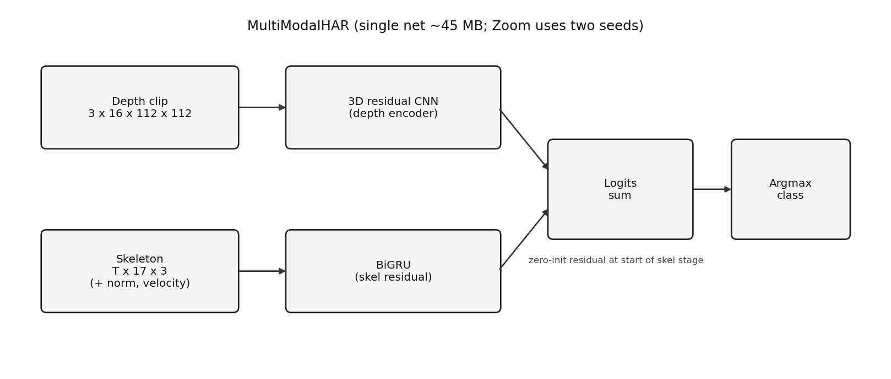
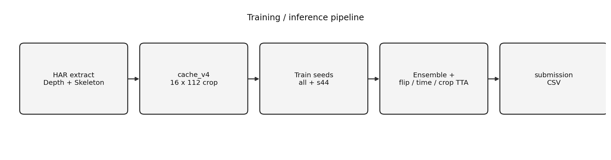

# cuhk-x-small-model

Privacy-preserving human activity recognition: classify everyday actions from depth video and body skeleton only, without RGB cameras. The stack is a compact 3D CNN on short depth clips plus a skeleton sequence model, trained end to end from scratch and small enough to run under a tight on-device weight budget.

The pipeline covers data caching, training, test-time augmentation, two-seed ensembling, and a single-script inference path that maps a folder of clips to class predictions.

## Result (Kaggle freeze)

| Item | Value |
| --- | --- |
| Selected submission | `submission_v4_all_s44_crop.csv` |
| Public score | **0.42786** |
| Backup selection | `submission_v4_ens_crop.csv` (0.41791) |
| Zoom entry | `inference.sh` |

Weights used at verification:

- `checkpoints/model_v4_all.pt` (seed 42)
- `checkpoints/model_v4_s44.pt` (seed 44, diversified train)
- flags: `--tta-flip --tta-time 2 --tta-crop`

Together the two checkpoints are ~90 MB, under the 100 MB cap.




## Method (short)

Depth is the main stream: person-cropped **16-frame / 112 px** clips through a small 3D residual CNN. Skeleton is a BiGRU residual (pose-normalized + joint velocity) that starts at zero so early training does not wreck the depth head. IMU and IR were tried and dropped for this submission.

Two independently trained nets are averaged at test time. TTA is horizontal flip, two temporal windows, and spatial crops.





**cache_v4** is the input we actually ship with: cropped depth + skeleton index. Older 8x64 caches (`cache_v2`) are historical only.

## Repo layout

```
har/              data loading, MultiModalHAR, submission helpers
scripts/          extract, cache, train, infer, distill
notebooks/        Colab entry notebook
configs/          path defaults for Drive / Colab
docs/             notes + figures
tests/            pipeline smoke tests
inference.sh      organizer entrypoint: data_dir -> CSV
checkpoints/      *.pt (gitignored; keep on Drive for Zoom)
cache_v4/         16x112 arrays (gitignored)
submissions/      Kaggle CSVs (gitignored)
```

## Setup

```bash
pip install -r requirements.txt
python tests/test_pipeline.py
```

Needs PyTorch with CUDA for training. Inference can run on CPU but is slow with crop TTA.

### Colab

1. Mount Drive.
2. Rsync **code only** into `/content/cuhk-x-small-model` (exclude `cache*`, `checkpoints`, `submissions`).
3. Point `--cache-index` / `--checkpoint` at Drive paths so outputs persist.

### Cache (once)

```bash
python scripts/extract_depth.py --modality Depth_Color
python scripts/extract_depth.py --modality Skeleton
python scripts/cache_depth.py \
  --data-root /content/har_extract \
  --out /path/to/cache_v4 \
  --num-frames 16 --image-size 112 --no-imu \
  --skel-index /path/to/cache_v2/index.csv
```

Expect depth shape `(3, 16, 112, 112)`.

### Train (example)

```bash
python scripts/train.py \
  --cache-index /path/to/cache_v4/index.csv \
  --use-skeleton --skel-norm --skel-velocity --mixup 0.2 --train-all \
  --epochs 30 --lr 1e-3 --batch-size 8 --seed 42 \
  --out checkpoints/model_v4_all.pt
```

Seed 44 used the same arch with higher mixup and `--balanced` for diversity.

### Infer / Zoom

```bash
./inference.sh /path/to/test_parent submission.csv
```

Or:

```bash
python scripts/infer.py \
  --data-root /path/to/test_parent \
  --checkpoint checkpoints/model_v4_all.pt \
  --aux-checkpoint checkpoints/model_v4_s44.pt \
  --tta-flip --tta-time 2 --tta-crop \
  --out submission.csv
```

Put the two `.pt` files next to `inference.sh` before the verification pack upload.

## What we did not use in the final CSV

| Attempt | Outcome |
| --- | --- |
| IMU fusion | Collapsed to person-ID (~0.16) |
| Wider net (~width 1.4) | 0.383 public |
| Depth temporal-diff channels | Below the 0.35 floor |
| IR residual on frozen trunk | Flat val |
| Extra FT / AdaBN / 3-model Zoom pack | Flat, worse, or over 100 MB |

Paper single-modality numbers near 90% depth are **cross-trial** benchmarks, not this track's cross-subject + 100 MB setup.

## Links

- [Kaggle competition](https://www.kaggle.com/competitions/cuhk-x-competition-small-model-track)
- [Challenge site](https://openaiotlab.github.io/CUHK-X-Challenge/)
- [CUHK-X dataset / paper materials](https://github.com/openaiotlab/CUHK-X)
